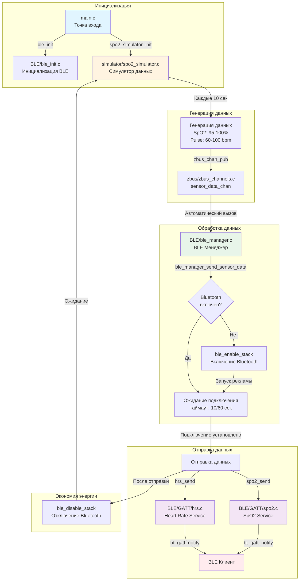
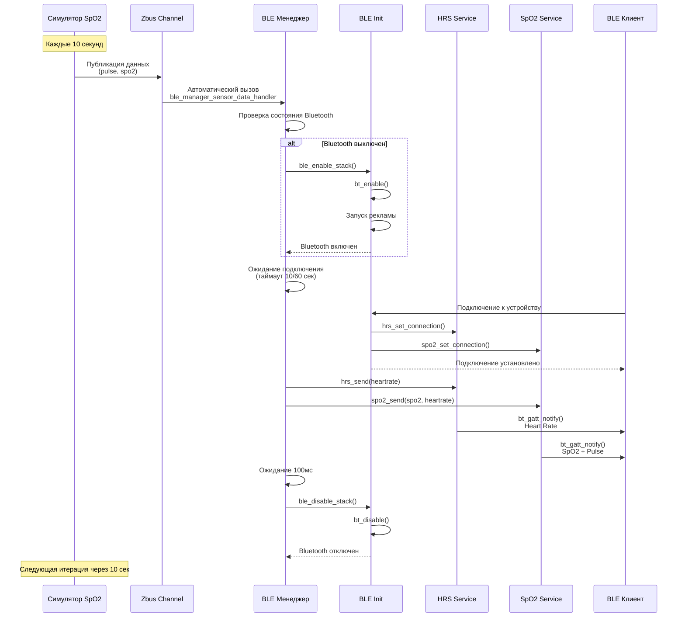
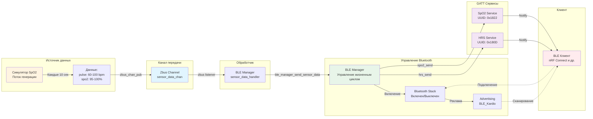

# BLE_Kardio - Bluetooth Heart Rate and SpO2 Monitor

Проект BLE периферийного устройства на базе Zephyr RTOS, реализующего сервисы Heart Rate Service (HRS) и Oxygen Saturation Service (SpO2) для мониторинга сердечного ритма и насыщения крови кислородом.

## Описание проекта

Устройство работает как BLE периферийное устройство (peripheral), которое:
- Рекламирует себя как "BLE_Kardio" через Bluetooth Low Energy
- Предоставляет два сервиса согласно спецификации Bluetooth SIG:
  - **Heart Rate Service (HRS)** - передача данных о сердечном ритме
  - **Oxygen Saturation Service (SpO2)** - передача данных о насыщении крови кислородом и пульсе
- Симулирует передачу данных о сердечном ритме и SpO2 через симулятор
- Использует архитектуру на основе zbus для асинхронной передачи данных между компонентами
- Автоматически управляет включением/выключением Bluetooth для экономии энергии
- Использует безопасное отложенное логирование для всех Bluetooth событий

## Архитектура проекта

### Основные компоненты

#### 1. **main.c** - Точка входа
- Инициализирует BLE стек через `ble_init()`
- Инициализирует симулятор SpO2, который начинает работу автоматически
- Основной цикл просто ожидает (все работает через события и потоки)

#### 2. **simulator/spo2_simulator.c** - Симулятор данных
- Запускает отдельный поток для симуляции измерений
- Генерирует данные каждые 10 секунд:
  - SpO2: 95-100% (циклически увеличивается)
  - Пульс: 60-100 bpm (циклически увеличивается на 2)
- Публикует данные в zbus канал `sensor_data_chan`
- Инициализируется при старте системы

#### 3. **zbus/zbus_channels.c** - Система обмена сообщениями
- Реализует канал `sensor_data_chan` для передачи данных от симулятора к BLE менеджеру
- Использует zbus для асинхронной передачи сообщений между компонентами
- Автоматически вызывает обработчик `ble_manager_sensor_data_handler` при публикации данных

#### 4. **BLE/ble_manager.c** - Высокоуровневый менеджер Bluetooth
- Обрабатывает данные от симулятора через zbus listener
- Управляет жизненным циклом Bluetooth:
  - Включает Bluetooth при необходимости отправки данных
  - Ожидает подключения клиента (таймаут 10 секунд, 60 секунд для первого подключения)
  - Отправляет данные через оба сервиса (HRS и SpO2)
  - Отключает Bluetooth после отправки для экономии энергии
- Функции:
  - `ble_manager_send_sensor_data()` - отправка данных пульса и SpO2
  - `ble_manager_enable_and_wait()` - включение и ожидание подключения
  - `ble_manager_disable_if_idle()` - отключение при отсутствии соединений
  - `ble_manager_wait_for_first_connection()` - ожидание первого подключения

#### 5. **BLE/ble_init.c** - Инициализация Bluetooth
- Инициализирует BLE стек и структуры
- Регистрирует колбэки для событий подключения/отключения
- Управляет LED индикатором состояния Bluetooth
- Регистрирует GATT сервисы (HRS и SpO2)
- Управляет жизненным циклом рекламы:
  - **При подключении**: останавливает рекламу (устройство уже подключено)
  - **При отключении**: Bluetooth отключается менеджером для экономии энергии
- Функции:
  - `ble_enable_stack()` - включение Bluetooth стека и запуск рекламы
  - `ble_disable_stack()` - отключение Bluetooth стека
  - `ble_is_enabled()` - проверка состояния стека
  - `ble_has_active_connections()` - проверка активных соединений

#### 6. **BLE/ble_advertising.c** - Управление рекламой
- Управляет состоянием BLE рекламы
- Отслеживает активность рекламы через флаг `advertising_active`
- Обрабатывает ошибки при остановке/запуске рекламы

#### 7. **BLE/ble_log.c** - Отложенное логирование
- **Проблема**: Прямое логирование (`LOG_INF`, `printk`) из колбэков Bluetooth может вызывать падение ядра, так как колбэки могут вызываться из контекста прерываний (ISR)
- **Решение**: Все логирование выполняется через отложенную работу (`k_work_delayable`), которая выполняется в контексте рабочего потока
- Функции:
  - `ble_log_connected()` - логирование подключения
  - `ble_log_disconnected()` - логирование отключения
  - `ble_log_security_changed()` - логирование изменения безопасности
  - `ble_log_info()` - общее информационное логирование
  - `ble_log_error()` - логирование ошибок

#### 8. **BLE/GATT/hrs.c** - Heart Rate Service
- Реализует стандартный HRS сервис Bluetooth SIG (UUID: 0x180D)
- **Характеристики**:
  - **Heart Rate Measurement** (Notify, UUID: 0x2A37) - передача данных о пульсе
  - **Body Sensor Location** (Read, UUID: 0x2A38) - местоположение датчика (Chest/0x01)
  - **Heart Rate Control Point** (Write, UUID: 0x2A39) - контрольная точка (зарезервировано)
- **Формат данных**: согласно спецификации HRS
  - Byte 0: Флаги (0x06 = UINT8 формат, контакт датчика обнаружен)
  - Byte 1: Значение пульса (UINT8, 0-255 bpm)
- **Отправка данных**: через функцию `hrs_send()`, вызываемую из BLE менеджера

#### 9. **BLE/GATT/spo2.c** - Oxygen Saturation Service
- Реализует стандартный Oxygen Saturation Service Bluetooth SIG (UUID: 0x1822)
- **Характеристики**:
  - **SpO2 Measurement** (Notify/Indicate, UUID: 0x2A5F) - передача данных о SpO2 и пульсе
  - Поддерживает как Notify, так и Indicate
- **Формат данных**: согласно спецификации PLX Continuous Measurement
  - Byte 0: Флаги (0x03 = SpO2PR-Normal present, Measurement Status present)
  - Byte 1-2: SpO2 значение в формате IEEE 11073 SFLOAT (2 байта, little-endian)
  - Byte 3-4: Pulse Rate в формате IEEE 11073 SFLOAT (2 байта, little-endian)
  - Byte 5-6: Measurement Status (2 байта, little-endian)
  - Всего: 7 байт
- **Отправка данных**: через функцию `spo2_send()`, вызываемую из BLE менеджера

## Диаграммы

### Архитектура системы



### Последовательность взаимодействий



### Поток данных (Dataflow)



## Поток работы

### Инициализация
1. `main()` вызывает `ble_init()`:
   - Инициализируется модуль отложенного логирования
   - Инициализируется отложенная работа для перезапуска рекламы
   - Настраивается LED индикатор
   - Регистрируются GATT сервисы (HRS и SpO2)
   - **Bluetooth стек НЕ включается автоматически** (экономия энергии)
2. `main()` вызывает `spo2_simulator_init()`:
   - Запускается поток симулятора
   - Симулятор ждет 2 секунды для инициализации системы

### Генерация и отправка данных
1. **Каждые 10 секунд** симулятор генерирует новые данные:
   - SpO2: увеличивается на 1 (95-100%, затем сброс)
   - Пульс: увеличивается на 2 (60-100 bpm, затем сброс)
2. Симулятор публикует данные в zbus канал `sensor_data_chan`
3. zbus автоматически вызывает `ble_manager_sensor_data_handler()`
4. BLE менеджер обрабатывает данные:
   - Вызывает `ble_manager_send_sensor_data()`
   - Включает Bluetooth стек (если не включен)
   - Ожидает подключения клиента (таймаут 10 сек, 60 сек для первого)
   - Если подключение установлено, отправляет данные через оба сервиса
   - Отключает Bluetooth после отправки (экономия энергии)

### Подключение клиента
1. При первом вызове `ble_manager_send_sensor_data()`:
   - Включается Bluetooth стек (`ble_enable_stack()`)
   - Запускается BLE реклама
   - Устройство становится видимым как "BLE_Kardio"
2. Клиент сканирует и находит устройство
3. Клиент подключается к устройству
4. Вызывается колбэк `connected()`:
   - Останавливается реклама (устройство уже подключено)
   - Устанавливается соединение для HRS и SpO2 сервисов
   - При необходимости запрашивается повышение уровня безопасности до L2
   - Включается LED индикатор
5. Клиент может подписаться на уведомления:
   - Heart Rate Measurement (HRS)
   - SpO2 Measurement (SpO2)

### Отправка данных клиенту
1. BLE менеджер отправляет данные через оба сервиса:
   - `hrs_send(heartrate)` - отправка пульса в HRS сервис
   - `spo2_send(spo2_value, heartrate)` - отправка SpO2 и пульса в SpO2 сервис
2. Данные отправляются через `bt_gatt_notify()` или `bt_gatt_indicate()`
3. После отправки BLE менеджер ждет 100мс и отключает Bluetooth для экономии энергии

### Отключение клиента
1. Клиент отключается
2. Вызывается колбэк `disconnected()`:
   - Очищается соединение для HRS и SpO2 сервисов
   - Вызывается `ble_manager_on_disconnected()`
   - Отключается Bluetooth стек (экономия энергии)
   - Выключается LED индикатор
3. При следующей генерации данных симулятором процесс повторяется

## Конфигурация

### prj.conf
- **Bluetooth**: 
  - Включен периферийный режим (`CONFIG_BT_PERIPHERAL`)
  - Имя устройства "BLE_Kardio" (`CONFIG_BT_DEVICE_NAME`)
  - Динамическая GATT база данных (`CONFIG_BT_GATT_DYNAMIC_DB`)
- **Логирование**: 
  - Отложенный режим (`CONFIG_LOG_MODE_DEFERRED`) для безопасности в ISR контексте
  - Уровень логирования: 3 (INFO)
  - Размер буфера: 4096 байт
- **Entropy**: Используется ESP32 RNG для генерации случайных чисел (требуется для BLE)
- **Zbus**: Включена поддержка zbus для межкомпонентной коммуникации (`CONFIG_ZBUS`)

## Особенности реализации

### Архитектура на основе событий
- Используется zbus для асинхронной передачи данных между компонентами
- Симулятор и BLE менеджер работают независимо через систему сообщений
- Легко расширяется для добавления новых источников данных

### Экономия энергии
- Bluetooth включается только при необходимости отправки данных
- После отправки данных Bluetooth автоматически отключается
- Первое подключение имеет увеличенный таймаут (60 секунд)
- Последующие подключения имеют стандартный таймаут (10 секунд)
- LED индикатор показывает состояние Bluetooth (включен/выключен)

### Безопасное логирование
Все логирование Bluetooth событий выполняется через отложенную работу, что предотвращает падение ядра при вызове из контекста прерываний.

### Управление рекламой
- Реклама автоматически останавливается при подключении
- Реклама запускается только при включении Bluetooth стека
- При ошибке запуска выполняется автоматический повтор

### Реализация GATT сервисов
- **HRS**: Реализован согласно спецификации Bluetooth SIG Heart Rate Service
- **SpO2**: Реализован согласно спецификации Bluetooth SIG Oxygen Saturation Service (PLX)
- Оба сервиса поддерживают стандартные характеристики и дескрипторы
- Данные отправляются по требованию через BLE менеджер

# Установка зависимостей

Следовать этой [инструкции](https://docs.zephyrproject.org/latest/develop/getting_started/index.html#install-dependencies)
из документации Zephyr.

# Развертывание workspace

В этой папке выполняем следующие команды:

#### С помощью uv

#### Linux/Mac

```sh
uv venv
. .venv/bin/activate
```

#### Windows

```sh
uv venv
. .venv/Scripts/activate
```

### С помощью pip

#### Linux/Mac

```sh
python -m venv .venv
. .venv/bin/activate
```

#### Windows

```sh
python -m venv .venv
. .venv/Scripts/activate
```

## Скачивание дистрибутива и модулей Zephyr

### С помощью uv

```sh
uv pip install west
west update
uv pip install -r deps/zephyr/zephyr/scripts/requirements.txt
west update
```

### С помощью pip

```sh
pip install west
west update
pip install -r deps/zephyr/zephyr/scripts/requirements.txt
west update
```

## Установка Zephyr SDK через west

```sh
west sdk install
```

Zephyr SDK скачается и установится в папку `$HOME/zephyr-sdk-<версия>/`.


# Образ прошивки

## Поддерживаемые платы

Проект поддерживает следующие платы:
- **ESP32 DevKitC** (`esp32_devkitc`) - основная целевая платформа
- **Native Simulator** (`native_sim`) - для тестирования и отладки на хосте

## Сборка

### Для ESP32 DevKitC

```sh
west build -b esp32_devkitc app
```

### Для Native Simulator (тестирование)

```sh
west build -b native_sim app
```

Собранный файл находится по пути: `build/zephyr/zephyr.bin` (для ESP32) или `build/zephyr/zephyr.elf` (для native_sim)

## Прошивка

### Для ESP32 DevKitC

```sh
west flash
```

### Для Native Simulator

```sh
west build -b native_sim -t run
```

## Запуск и тестирование

После прошивки устройство:
1. Инициализирует BLE стек (но не включает его сразу)
2. Запускает симулятор SpO2
3. Каждые 10 секунд генерирует новые данные
4. При генерации данных включает Bluetooth и ожидает подключения
5. После подключения отправляет данные через оба сервиса (HRS и SpO2)
6. Отключает Bluetooth для экономии энергии

Для подключения используйте любое BLE приложение (например, nRF Connect) и найдите устройство "BLE_Kardio".

